# Facial-Expression-Recognition

## კონკურსის მიმოხილვა

მოცემული გვაქვს ადამინაის სახის სურათები პიქსელების სახით და 7 ტიპის ემოცია. ჩვენი მიზანია
დავაპროგნოზოთ ადამიანის სურათი რა ემოციას გამოხატავს - შევუსაბამოთ რიცხვი 0-6 ჩათვლით

 - 0=Angry
 - 1=Disgust 
 - 2=Fear
 - 3=Happy 
 - 4=Sad 
 - 5=Surprise
 - 6=Neutral

## ჩემი მიდგომა ამოცანის გადასაჭრელად

ამოცანის გადასაჭრელად გამოვიყენე 3 ტიპის `CNN` სირთულის არქიტექტურა, რომელზეც დავატრენინგე
მოდელები მოცემული `train.csv` დატათი, შემდგომ დავლოგე პარამეტრები `wandb` ზე და მეტრიკებით
შევაფასე მოდელის ეფექტურობა. დავაკვირდები როგორ იცვლება `accuracy` სხვადასხვა არქიტექტურაში
`layer`-ების დამატებისას.


## EDA მონაცემების დაკვირვება

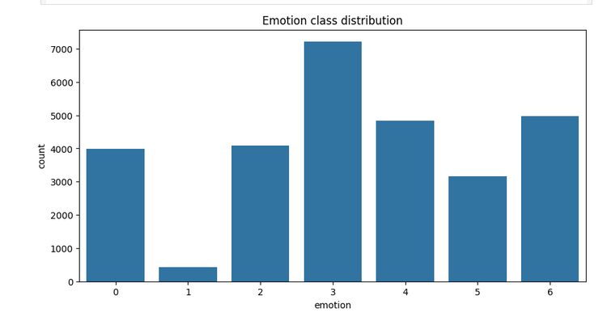
- როგორც ვხედავთ ყველაზე მეტი სურათი არის ბედნიერი ემოციის ხოლო დანარჩენი ემოციის
 სურათები საშუალოსთან ახლოს რაოდენობით არიან, გარდა ზიზღის ემოციისა.

- Pixels mean:  129.47433955331468
- Pixels std:  65.02727348443116
 პიქსელების მნიშვნელობა საუშუალოდ 129.47 ხოლო სტანდარტული გადახრა 65.02

ამ დატას დაჭირდება ნორმალიზაცია რაღაც ფორმით რასაც განვიხლავთ მოდელებში, რადგან სტანდრტული გადახრა მაღალია
და გაფანტულია

- რადნომ 15 სურათი ტრეინ სეტიდან
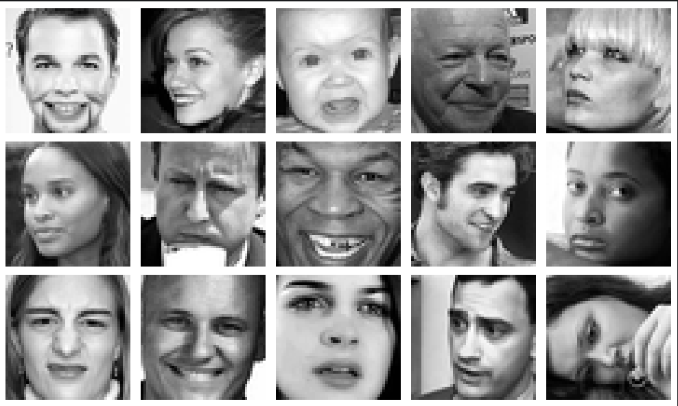

შავ თეთრი პიქსელები გვაქვს რადგან გვაქვს მხოლოდ 1 channel ანუ თითო სურათი
48x48 მატრიცაა რომლის თითოეული ელემენტი 0-255 ჩათვლითაა.

# მოდელები

### BaseCNN არქიტექტურა

```
          Conv2d(1, 16, kernel_size=3, padding=1)
          ReLU()
          MaxPool2d(2)
          Conv2d(16, 32, kernel_size=3, padding=1)
          ReLU()
          MaxPool2d(2)
          
          Flatten()
          Linear(32*12*12, 128)
          ReLU()
          Linear(128,7)

```
`BaseCNN` მოდელში გვაქვს 2 `convolution` და 2 `Linear` layer საბაზისოდ.
- 1 `Conv layer` | 16 ფილტრი 3x3 ზე `channel` = 1
- 2 `Conv layer` | 32 ფილტრი 3x3 ზე `channel` = 16

- `ReLU`  არაწრფივობის გასაჩენად


- 1 `Linear layer` | 1x128 ვექტორი
- 2 `Linear layer` | 1x7 ვექტორი

### MediumCNN არქიტექტურა
```
       Conv2d(1, 32, kernel_size=3, padding=1)
       BatchNorm2d(32)
       ReLU()
       MaxPool2d(2)

       Conv2d(32, 64, kernel_size=3, padding=1)
       BatchNorm2d(64)
       ReLU()
       MaxPool2d(2)

       Conv2d(64, 128, kernel_size=3, padding=1)
       BatchNorm2d(128)
       ReLU()
       MaxPool2d(2)
       
       Flatten(),
       Linear(128 * 6 * 6, 256),
       ReLU(),
       Dropout(0.5),
       Linear(256, 7)

```

`MediumCNN` მოდელში გვაქვს 3 `convolution` და 2 `Linear` layer და 1 Dropout
- `ნორმალიზაცია Batch Normalization`. batch ში თითოელი სურათის, თითოეული
channel ის ნორმალიზაცია.
- `რეგულარიზაცია Dropout(0.5) ` 0.5 ალბათობით მიმდინარე ნეირონების ითიშება

- 1 `Conv layer` | 16 ფილტრი 3x3 ზე `channel` = 1
- 2 `Conv layer` | 32 ფილტრი 3x3 ზე `channel` = 16
- 3 `Conv layer` | 64 ფილტრი 3x3 ზე `channel` = 32

- `ReLU`  არაწრფივობის გასაჩენად

- 1 `Linear layer` | 1x128 ვექტორი
- 2 `Linear layer` | 1x7 ვექტორი

- `Dropout` p = 0.5
- `BatchNormalization`

### AdvancedCNN არქიტექტურა
```
      Conv2d(1, 32, 3, padding=1)
      BatchNorm2d(32)
      ReLU()
      Conv2d(32, 32, 3, padding=1)
      BatchNorm2d(32)
      ReLU()
      MaxPool2d(2)
      Dropout(0.1)

      Conv2d(32, 64, 3, padding=1)
      BatchNorm2d(64)
      ReLU()
      Conv2d(64, 64, 3, padding=1)
      BatchNorm2d(64)
      ReLU()
      MaxPool2d(2)
      Dropout(0.2)

      Conv2d(64, 128, 3, padding=1)
      BatchNorm2d(128)
      ReLU()
      MaxPool2d(2)
      Dropout(0.3)
      
      Flatten()
      Linear(128 * 6 * 6, 256)
      ReLU()
      Dropout(0.5)
      Linear(256, 7)
```
`AdvancedCNN` მოდელში გვაქვს 5 `convolutional` და 2 `Linear` layer
5 BatchNorm და 4 dropout ნორმალიზაცია-რეგულარიზაცია

- 1 `Conv layer` | 32 ფილტრი 3x3 ზე `channel` = 1
- 2 `Conv layer` | 32 ფილტრი 3x3 ზე `channel` = 32
- 3 `Conv layer` | 64 ფილტრი 3x3 ზე `channel` = 32
- 4 `Conv layer` | 64 ფილტრი 3x3 ზე `channel` = 64
- 5 `Conv layer` | 128 ფილტრი 3x3 ზე `channel` = 64

- 1 `Linear layer` | 1x128 ვექტორი
- 2 `Linear layer` | 1x7 ვექტორი

- `ReLU`  არაწრფივობის გასაჩენად


- `BatchNorm` ნორმალიზაციას ვაკეთებ ყოველი `Conv` layer ის შემგდომ
- `dropout` რეგულარიზაციას ვაკეთებ ყოველი MaxPool შემდეგ

## layer-ების დამატების მიზანი
 - `BaseCNN` -> `MediumCNN` -> `AdvancedCNN`
ყველაზე მარტივი მოდელია BaseCNN მოდელი სადაც გვაქვს სტანდარტული ნეირონული ქსელი, MediumCNN ში
ვამატებ ნორმალიზაციას თითოეული batch-ზე თითოეულ channel-ზე. ეს გვეხმარება იმისთვის რომ გრადიენტის ძალიან გაზრდა და შემცირება
არ მოხდეს. ისედაც ყველა პიქსელს ვყოფ 255-ზე თავიდანვე რომ 0-1 მდე იყოს. `dropout` ვამატებ იმისთვის რომ 
ვარიაციის ზრდა არ მოხდეს overfit ისკენ არ წავიდეს და ტრეინი არ დაიზეპიროს და ვალიდაციაზე ჩაიჭრას. 
`MediumCNN` -> `AdvancedCNN` ვამატებ უფრო მეტ `layers` იმისთვის რომ კომპლექსური დამოკიდებულებები ისწავლოს.


# შედეგების ანალიზი ტრენინგი და wanb-ზე დალოგვა

- ტრენინგის დროს ვუშვებ 10 მდე epoch-ს 
- გამოყენებული მეტრიკები. 
    - `f1`, `precision`, `recall`, `val_acc`, `train_loss`, `val_loss`
- `advanced_model0` ში ვიყენებ ზევით ხსენებულ ყველას, ხოლო დანარჩენებში `val_acc`, `train_loss` `val_loss`

### ჰიპერპარამეტრები
```
      lrs = [1e-3, 1e-2, 1e-1]
      batch_sizes = [10, 32, 64]
      optimizers = ["adam", "sgd"]
```
გადავარჩევ ჰიპერმარამეტრებს `learning rates`, `batch_sizes`, `optimizers`

### განვიხილოთ შედეგები

##  BaseCNN 
 - lr = 0.01
 - batch_size = 64
 - optimizer = adam
 - 5 epochs

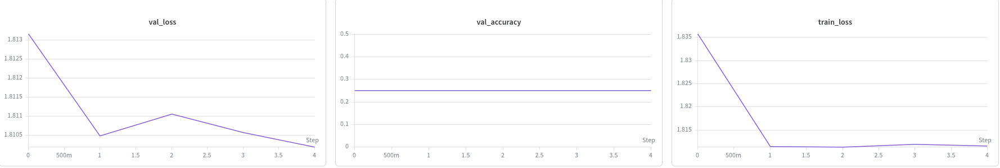

დავაკვირდეთ რომ `train_loss` 1-2 ეპოქის მერე საგრძნობლად იკლებს
ხოლო `val_loss` იკლებს, იზრდება და შემდგომ მინიმალურამდე ილებს.
რაც შეეხება `val_acc` ყველა ეპოქაზე იგივეა მუდმიმვად `0.25`

მოდელის სიმარტივის გამო ვერ ისწავლა კარგად მონაცემებს შორის დამოკიდებულებები
შესაბამისად მოხდა მცირდი overfit ანუ როცა train loss მცირეა და val_acc დაბალია
ან train_acc დიდია და val_acc მცირე და გეფი დიდია. 
`0.25 ` ძალიან ცოტაა ანუ საშუალოდ 4ში 1-ს იცნობს სწორად მოდელი
ვალიდაციის სიზუსტის მუდმივობის ერთ ერთი მიზეზი ისაა, რომ მოდა gradient vanishing ანუ გრადიენტი 0 ხდებოდა
მაშინვე, რადგან 255ზე ვყოფდი ყველა ფიქსელის მნიშვნელობას შესაბამისად დაუნორმალიზირებული დატას გამოწვეულია ეს შედეგი
 
მოდი შევადაროთ სხვა ჰიპერპარამეტრების შედეგებს და საბოლოო დასკვა მერე ვქნათ


 - lr = 0.001
 - batch_size = 32
 - optimizer = sgd
 - 5 epochs

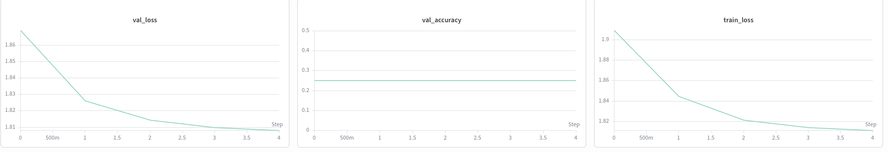

თუ დავაკვირდებით ჰიპერმარამეტრების ცვლილებით შედეგი მაინც უცვლელია
5 ეპოქის შემდეგ val_acc ისევ მუდმივია ორივე შემთხვევაში.


 - lr = 0.001
 - batch_size = 64
 - optimizer = adam
 - 5 epochs

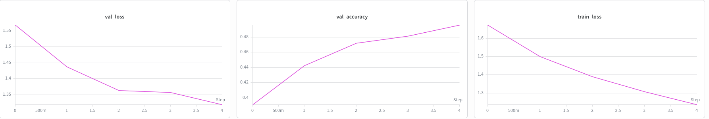

პირველი მოდელისგან განსხვავება მხოლოდ `learning rate` შია. 
ესეიგი მოდელი მგრძნობიარეა lr მიმართ ანუ წონა - loss ფუნქციის გრადიენტს წონის მიმართ * lr 
რომ ვაკეთებდით დიდ lr-ზე ხტუნაობდა აქეთ იქით და მინიმუმის წერტილს ვერასდროს აღწევდა. ხოლო როცა
lr = 0.001 პატარა ნაბიჯებით ვუახლოვდებით 'მინიმუმის წერტილს', მთლად მინიმუმის წერტილი ცხადია არაა
რადგან 5 ეპოქაში ვერ მიიღწევა, უბრალოდ მსურდა დამედგინა დამოკიდებულებები ჰიპერპარამეტრებს შორის, რადგან
მოდელი იმდენად მარტივია რომ ვერ ისწავლიდა მნიშვნელოვან ინფორმაციას

წინა ორ მოდელში იმიტომ იყო მუდმივი ვალიდაციის სიზუსტე, რომ ლერნინგ რეითი იყო მაღალი ერთ შემთხვევაში
ხოლო მეორე შემთხვევაში დაბალი იყო მაგრამ ვიყენბდი `sgd` ოპტიმაიზერს რომელიც როგორც ჩანს
ზიგზაგურად ხტუნაობდა და ვერ მიაღწია იმ წერტილს რომ გაზრდილიყო ვალიდაციის სიზუსტე.
ანუ დავადგინეთ რომ `learning rates` და `optimizers` აქვს გავლენა სუსტი მოდელის ეფექტურობაზე


###
## MediumCNN
 - lr = 0.001
 - batch_size = 10
 - optimizer = sgd
 - 5 epochs

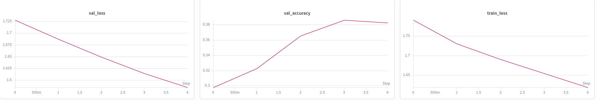

`MediumCNN`მოდელში დავამატეთ `batch normalization` და `dropout` რეგულარიზაცია რატთა `overfit` რისკი შეგვემცირებინა

ყოველი ეპოქისას ვალიდაციის ერორი მცირდება და ვალიდაციის სიზუსტე იზრდება რაც ნიშნავს რომ მოდელი დაიხვეწა და
პრობლემა ის არის რომ ვალიდაციის სიზუსტე მაინც დაბალია საგრძნობლად, მაქსიმუმი იყო `0.38`
`batch_size` = 10 და ოპტიმაიზერი `sgd` არ არის საკმარისი იმისთვის რომ მონაცემებს კარგად გარდაიქმნას და
სტანდარტული გრადიენტის დროს ვხედავთ რომ 4ე ეპოქის დროს პიკში იყო ხოლო მეხუთე ეპოქისას დაიკლო ცოტა
ანუ არასტაბილურია. უკეთ განსახილვად სხვა მოდელებს შევადაროთ


 - lr = 0.001
 - batch_size = 10
 - optimizer = adam
 - 5 epochs

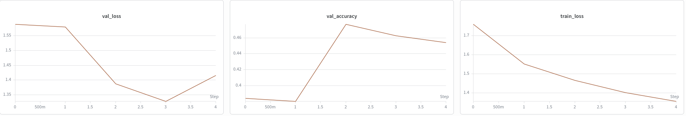

როგორც ვხედავთ ოპტიმიაზერი ადამის გამოყენების შემდეგ ვალიდაციის სიზუსტე გაიზარდა `0.47` მდე

ნუ რადგანაც ცოტა ეპოქაზე ვუშვებ შეიძლება იცვალოს მინშვნელობები, ანუ სულ ზრდა არ იყოს მაგრამ როგორც
ვხედავთ ოპტიმაიზერს დიდი მნიშვნელობა აქვს რადგან გრადიენტის ვექტორი ხშირად `loss` ფუნქციის
მინიმუმის მიმართულებით იყურება. 

 - lr = 0.0003
 - batch_size = 32
 - optimizer = adam
 - 5 epochs

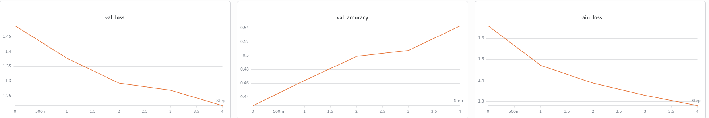

learning rate ის შემცირებით და batch_size გაზრდით როგორც ვხედავთ ვალიდაციის სიზუსტე მუდმივად იზრდება
ანუ batch_size გაზრდით უკეთესად დანაწერვდა მონაცემები და შესაბამისად ნორმალიზაციამ გრადიენტის სტაბილურობას
შეუწყო ხელი რომ არ შემცირებულიყო 0კენ, როგორც ვიცით პიქსელები 0დან 1მდე მოვაქციე.
learning rate ის სიმცირეც მოწმობს იმას რომ არ ხდება ხტუნაობა აქეთ იქით წონების გრადიენტის loss ის მიმართ
ვექტორების. ხოლო დამატებით dropout მა უზრუნველყო ყველა ნეირონს კარგად დაეჭირა მნიშვნელოვანი ინფორმაცია
0.54 ვალიდაციის სიზუსტე მეორე საუკეთესო შედგეი იყო.
მოდი გადავიდეთ advanced model ზე


## AdvancedCNN


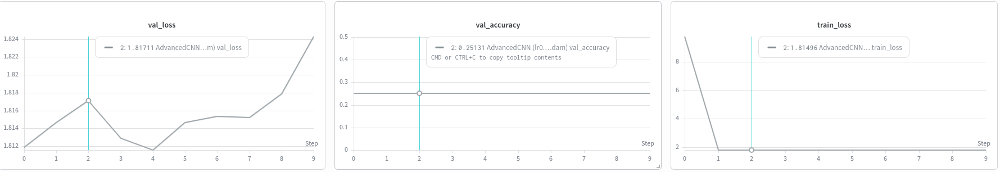
 - lr = 0.1
 - batch_size = 64
 - optimizer = adam
 - 10 epochs

როგორც ვხედავთ ეპოქების ზრდასთან ერთად ვალიდაციის loss იზრდება, რაც უნცაურია და ვალიდაციის სიზუსტე
მუდმივია. ერთ ერთი მთავარი მიზეზი learning_rate = 0.1 ძალიან დიდია ანუ გრადიენტ ვექტორის გამოკლებით
კიარ მიახლოვდა მინიმუმს არამედ გაცდა და იმ წერტილში დაჯდა სადაც უფრო ცუდი იყო ვიდრე მანამდე იყო
შესაბამისად ვალიდაციის სიზუტსე და loss იქნებოდა დაბალი და მაღალი.


 - lr = 0.001
 - batch_size = 10
 - optimizer = adam
 - 10 epochs

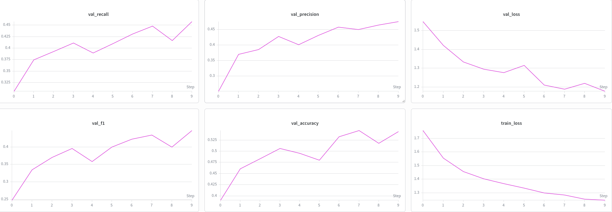

როგორც ვხედავთ advanced model ში გვაქვს batch_normalization და dropout ები რაც ვარიაციას ამცირებს და
გრადიენტს updateს ეხმარება. batch_size = 10 გამო ცოტა იცვლება იზრდება იკლებს მაგრამ მაინც
ზრდადია `val_acc`, `f1`, `precision`, `recall` მნიშვნელობები.


საუკეთესო მოდელი

 - lr = 0.001
 - batch_size = 32
 - optimizer = adam
 - 10 epochs

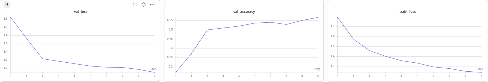

ყველა ჰიპერპარამეტრი არის კარგად შერჩეული და შესაბამისად ვალიდაციის სიზუსტე ყველაზე მაღალია.
- `learning_rate` არც ძაან დიდი არც ძაან ცოტა რომ კარგად მოხდეს update
- `batch_size` = 32   საკმარისი იმისთვის რომ კარგად არ იყოს გამონაკლისი წერტილების ხარჯზე ნორმალიზაცია
- `optimizer` = `adam` როგორც ვნახეთ `adam` >> `sgd` რადგან უფრო სწრაფად აღწევს მინიმუმის წერტილს ხტუნაობის გარეშე
- `dropout` - იმისთვის რომ არ მოხდეს ვარიაციის ზრდა დ overfit ში წასვლა


